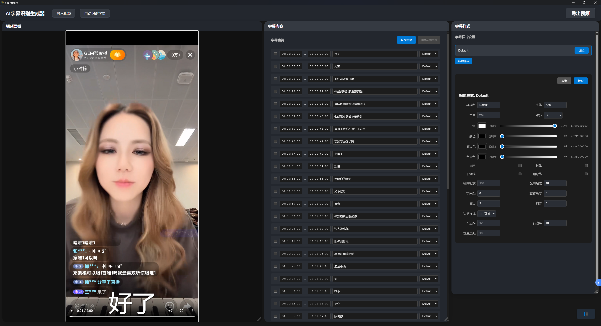
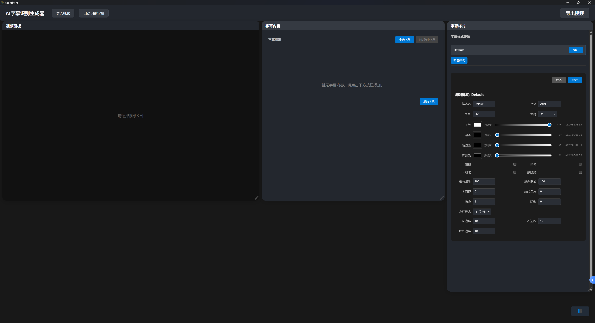
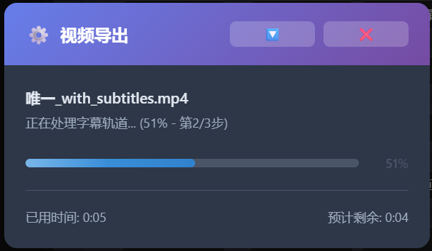
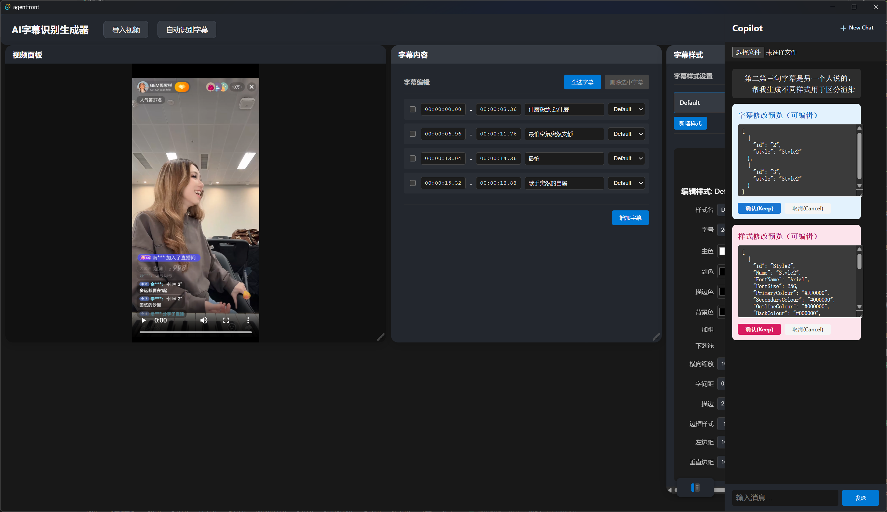

# VideoCaptionsAI - 智能视频字幕处理系统

AI驱动的视频字幕识别、编辑、样式设计和硬字幕烧录一体化解决方案。

## 🎬 功能展示

### 1. 字## 项目详情

本仓库包含两个智能视频字幕相关项目：VideoSubs（后端服务）与 AgentFront（桌面端）。

### VideoSubs与样式设计

- **智能布局**：可拖拽的面板式布局，支持视频预览、字幕编辑、样式设计三个区域
- **实时编辑**：支持字幕文本的实时编辑，所见即所得
- **样式设计**：完整的ASS样式编辑面板，支持字体、颜色、描边、阴影等专业设置

### 2. 自动语音识别生成字幕

- **AI语音识别**：基于Whisper模型的高精度语音转文字
- **批量处理**：自动识别并生成时间轴精确的字幕条目
- **智能断句**：AI智能分段，确保字幕显示效果自然流畅

### 3. 硬字幕烧录导出

- **一键烧录**：将设计好的字幕永久烧录到视频中
- **实时进度**：显示详细的处理进度和预计完成时间
- **高质量输出**：保持原视频画质，支持多种输出格式

### 4. AI Copilot 智能助手

- **智能润色**：AI自动优化字幕内容，提升表达质量
- **批量处理**：支持对整个字幕项目进行智能优化
- **样式建议**：AI提供专业的字幕样式设计建议
- **交互式编辑**：通过自然语言与AI对话，完成复杂的编辑任务

---

## ✨ 核心特性

- **🎯 专业级字幕制作**：支持ASS格式的完整样式系统，包括字体、颜色、描边、阴影、对齐等
- **🤖 AI智能优化**：集成大语言模型，自动优化字幕内容和样式，提升表达质量
- **⚡ 实时预览**：所见即所得的字幕预览，确保最终效果与设计一致
- **🔄 流式处理**：支持SSE流式输出，提供流畅的实时编辑体验
- **📱 响应式布局**：可拖拽的面板布局，适应不同屏幕尺寸和工作习惯
- **🎬 一键导出**：高质量硬字幕烧录，支持多种视频格式输出

---

## 项目简介

---

## 🚀 快速开始

### 环境要求
- Python 3.8+
- Node.js 16+
- Rust (用于Tauri桌面端)
- ffmpeg

### 一键启动开发环境

1. **克隆项目**
   ```bash
   git clone https://github.com/tanghuanqiang/VideoCaptionsAI.git
   cd VideoCaptionsAI
   ```

2. **配置环境变量**
   ```bash
   cp .env.example .env
   # 编辑 .env 文件，填入你的API Keys
   ```

3. **启动后端服务**
   ```bash
   cd VideoSubs
   pip install -e .
   uvicorn src.app:app --reload
   ```

4. **启动前端应用**
   ```bash
   cd agentfront
   yarn install
   yarn dev
   # 或启动桌面版
   yarn tauri dev
   ```

5. **开始使用**
   - 打开浏览器访问 `http://localhost:5173`
   - 上传视频文件开始自动字幕识别
   - 编辑字幕内容和样式
   - 导出带字幕的视频

---

## 项目详情

## VideoSubs

**简介**：轻量级后端服务，专注于智能视频字幕处理，集成 Whisper 语音识别、LangGraph+LLM AI 优化、字幕样式编辑与硬字幕烧录。

**主要功能**：
- Whisper 离线语音识别，自动生成结构化字幕
- LangGraph+LLM AI 批量优化字幕内容与样式
- ffmpeg 硬字幕烧录导出
- SSE 实时流式输出，支持前端实时编辑体验
- API 支持字幕识别、烧录、AI Copilot 指令(例如让它修改某条字幕内容，让它区分字幕speaker不同生成不同样式便于区分)等

**技术栈**：Python + FastAPI + Whisper + LangGraph + LangChain + ffmpeg + PyTorch

**快速开发/使用**：
1. 安装依赖
   ```powershell
   cd VideoSubs
   pip install -e .
   ```

2. 启动服务前，参考配置方法（推荐）：
   1. 复制 `.env.example` 为 `.env`，填写你的 Key：
      ```powershell
      copy .env.example .env
      # 然后用编辑器打开 `.env` 填入你的值
      ```
   2. `.env` 放在VideoSubs的仓库根目录，`src/agent/SubsAI.py` 会自动加载（需要 `python-dotenv`）。
   3. 下面是 `.env` 中常用变量及获取链接（把它们全部放到 `.env` 中）：
      - `TAVILY_API_KEY` — **必须** Tavily 搜索/工具整合 Key。获取文档：[Tavily Search Docs](https://python.langchain.ac.cn/docs/integrations/tools/tavily_search/)
      - `LLM_API_KEY` — **必须** 通用 LLM Key（OpenAI 或兼容服务）。如果使用 OpenAI，请在 OpenAI 控制台创建 API Key；若使用兼容端点，把该 Key 填入。[阿里云模型 Studio](https://help.aliyun.com/zh/model-studio/new-free-quota)
      - `LLM_MODEL_NAME` — **可选**，覆盖默认模型名称（例如 `qwen-turbo`）。
      - `LLM_OPENAI_BASE` — **可选**，覆盖 OpenAI 兼容的 base URL（例如阿里/自托管兼容端点）。
      - `LANGSMITH_API_KEY` — **可选**，用于 LangSmith/监控（如果你使用该服务）。
      - `WHISPER_MODEL` — **可选**，指定 Whisper 模型（默认 `large-v3`，可改为 `medium`/`small` 以节省资源）。

3. 首次建议先下载 Whisper large-v3 模型（推荐使用工具脚本）
   ```powershell
   python src/utils/download_models.py
   # 或快速下载（非交互式）
   python -c "import whisper; whisper.load_model('large-v3')"
   ```

4. 启动服务
   ```powershell
   uvicorn src.app:app --reload
   ```

**联系方式**：
- Email: 1803206379@qq.com
- WeChat: wNANAfREEDOM
- GitHub Issues/PR

---

## AgentFront

**简介**：桌面级视频字幕处理工具，集成自动语音识别（ASR）、字幕可视化编辑、ASS样式定制、硬字幕烧录导出，以及可选 AI Copilot 智能建议。

**主要功能**：
- 自动语音识别生成字幕
- 字幕批量编辑、样式调整、实时预览
- ASS 字幕样式面板，支持字体、颜色、描边、阴影等
- 一键硬字幕烧录导出 MP4
- AI Copilot 智能批量润色/修正建议
- Tauri 打包为跨平台桌面应用

**技术栈**：React + TypeScript + Vite + Tauri (Rust) + FastAPI (Python) + ffmpeg/whisper

**快速开发/使用**：
1. 安装依赖
   ```powershell
   cd agentfront
   yarn install #需自行安装yarn
   ```
2. 启动后端（完整教程在上方）
   > 启动前请先获取 API Key，并复制 `.env.example` 为 `.env`，用编辑器填写你的 Key。
   ```powershell
   uvicorn src.app:app --reload 
   ```
3. 启动前端开发
   ```powershell
   yarn dev
   ```
4. 启动桌面端（可选）
   ```powershell
   yarn tauri dev
   ```

**联系方式**：Email: 1803206379@qq.com

---

## 项目现状与发展规划

### 🚧 **当前不足与待实现功能**

#### VideoSubs (后端服务)
**已实现**：
- ✅ Whisper 语音识别基础功能
- ✅ FastAPI 服务框架
- ✅ LangGraph+LLM AI 优化架构
- ✅ SSE 流式输出

**待完善**：
- ⏳ **字幕时间轴精度优化** - 目前依赖 Whisper 原始时间戳，需要增加手动微调功能
- ⏳ **多语言翻译支持** - 计划集成翻译 API，支持字幕多语言生成
- ⏳ **批量处理队列** - 大文件处理时需要后台任务队列管理
- ⏳ **字幕格式扩展** - 目前主要支持 ASS，计划添加 SRT、VTT 等格式
- ⏳ **语音识别准确度提升** - 针对中文、方言、专业术语的识别优化
- ⏳ **容器化部署** - 提供 Docker 镜像，简化部署流程
- ⏳ **字幕正确预览** - 未实现预览与输出完全一致，还需完善

#### AgentFront (桌面端)
**已实现**：
- ✅ React + Tauri 桌面应用框架
- ✅ 字幕编辑界面基础功能
- ✅ ASS 样式编辑面板
- ✅ 可拖拽布局系统

**待完善**：
- ⏳ **时间轴可视化编辑** - 类似专业视频编辑软件的时间轴界面
- ⏳ **音频波形显示** - 便于精确调整字幕时间点
- ⏳ **批量操作优化** - 字幕批量替换、格式化、时间偏移等
- ⏳ **预览功能增强** - 实时预览字幕在视频上的最终效果
- ⏳ **快捷键支持** - 提升编辑效率的键盘快捷键
- ⏳ **项目管理功能** - 字幕项目的保存、加载、版本管理
- ⏳ **性能优化** - 大文件处理时的内存和渲染优化

### 🎯 **短期目标 (1-2 个月)**
1. **完善核心编辑功能** - 时间轴编辑、批量操作
2. **提升用户体验** - 界面优化、性能提升、错误处理
3. **增加部署选项** - Docker 容器化、安装包打包

### 🚀 **中期目标 (3-6 个月)**
1. **多语言翻译集成** - 支持字幕自动翻译功能
2. **AI 功能扩展** - 智能断句、说话人识别、情感分析
3. **协作功能** - 多人协作编辑、云端同步

### 🌟 **长期愿景 (6 个月以上)**
1. **专业级功能** - 音视频同步、字幕特效、高级样式
2. **平台扩展** - Web 版本、移动端适配
3. **生态建设** - 插件系统、第三方集成、开放 API

---

如需更多帮助或反馈，欢迎通过邮箱或 GitHub Issue 联系。


